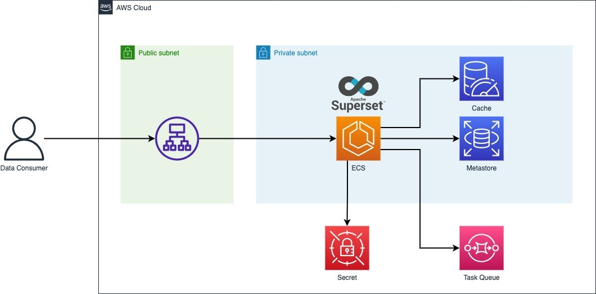

# aws-apache-superset-deployment

This is a sample for deployment Apache Superset with using AWS managed services like SQS, ElastiCache over ECS.

## Architecture

## Added Plug-ins

### Celery

- [DynamoDB](https://docs.celeryq.dev/en/stable/userguide/configuration.html#aws-dynamodb-backend-settings)

- [S3](https://docs.celeryq.dev/en/stable/userguide/configuration.html#s3-backend-settings)

### Database Drivers

- [AWS Athena](https://superset.apache.org/docs/databases/athena/)

- [Google BigQuery](https://superset.apache.org/docs/databases/bigquery/)

- [ElasticSearch](https://superset.apache.org/docs/databases/elasticsearch)

## Environment Varibles

### Metastore Setting

- DATABASE_DIALECT

- DATABASE_USER

- DATABASE_PASSWORD

- DATABASE_HOST

- DATABASE_PORT

- DATABASE_DB

### Redis (for Celery)

- REDIS_HOST

### Superset Setting

- WEBDRIVER_BASEURL

- SUPERSET_SECRET_KEY
