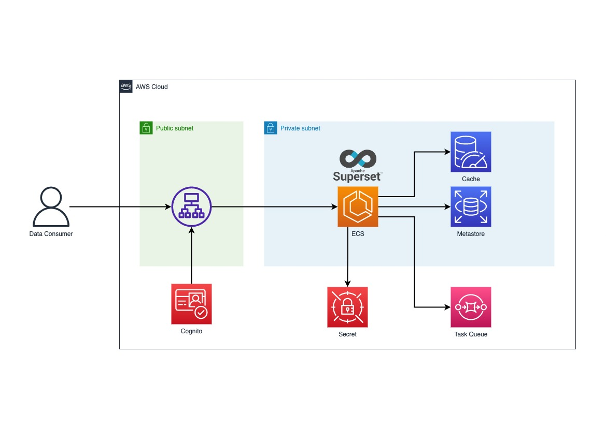

# aws-apache-superset-deployment

## Architecture

## Highlighted Environment Varible

### Basic

SUPERSET_ROW_LIMIT
SUPERSET_SECRET_KEY
SUPERSET_METADATA_DB_URL

### Cache

SUPERSET_CACHE_REDIS_HOST
SUPERSET_CACHE_REDIS_PORT
SUPERSET_CACHE_REDIS_PASSWORD
SUPERSET_CACHE_REDIS_DB
SUPERSET_CACHE_REDIS_URL

### Notification

#### Slack

SUPERSET_NOTIFICAITON_SLACK_API_TOKEN

#### SMTP

SUPERSET_NOTIFICATION_SMTP_HOST
SUPERSET_NOTIFICATION_SMTP_STARTTLS
SUPERSET_NOTIFICATION_SMTP_SSL
SUPERSET_NOTIFICATION_SMTP_USER
SUPERSET_NOTIFICATION_SMTP_PORT
SUPERSET_NOTIFICATION_SMTP_PASSWORD
SUPERSET_NOTIFICATION_SMTP_MAIL_FROM

### Web

SUPERSET_ENABLE_CORS
SUPERSET_WEBDRIVER_BASEURL
SUPERSET_WEBSERVER_DOMAINS
SUPERSET_WEBSERVER_PORT
